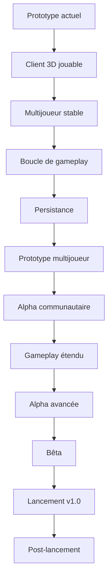

# 🗺️ ROADMAP — The Last Signal

> *MMORPG de survie post-apocalyptique en monde persistant*
> **Dernière mise à jour :** 8 octobre 2026
> **Version actuelle :** 0.1.0 — Prototype

---

## 🎯 Vision

**The Last Signal** vise à devenir un MMORPG de survie post-apocalyptique en monde persistant.

La priorité actuelle n'est pas de construire immédiatement toutes les fonctionnalités du jeu final.

La priorité est de transformer progressivement le prototype technique actuel en une **expérience réellement jouable**, puis de la faire tester par des contributeurs et des joueurs.

> **Objectif principal : passer d'un prototype technique à un prototype jouable.**

---

# 📅 Phases

---

## 🟢 Phase 1 — Prototype jouable

**Période : octobre 2026 → décembre 2026**

### Objectif

Obtenir une première version suffisamment jouable pour qu'une personne extérieure puisse lancer le projet, se connecter au serveur, se déplacer et voir les autres joueurs dans un environnement 3D.

| Tâche                   | Sous-tâches                                             | État                | Critère de succès                                                    |
| ----------------------- | ------------------------------------------------------- | ------------------- | -------------------------------------------------------------------- |
| 🎮 **Client 3D**        | Finaliser la transition du prototype 2D vers VisPy      | 🟡 En cours         | Le joueur peut se déplacer dans l'environnement 3D                   |
| 🗺️ **Carte 3D**        | Heightmap, couleurs et collisions                       | 🟡 En cours         | Une zone de jeu cohérente est affichée                               |
| 👥 **Multijoueur**      | Synchronisation des joueurs                             | 🟡 En cours         | Les joueurs connectés apparaissent correctement                      |
| 🌐 **Protocole réseau** | Connexion, session, déplacement, apparition/disparition | 🟡 En cours         | Les états des joueurs restent synchronisés                           |
| 🔐 **Authentification** | Connexion et gestion des sessions                       | 🟢 Fonctionnel      | Un joueur peut créer/utiliser une session                            |
| 🎒 **Inventaire**       | Gestion des objets et quantités                         | 🟢 Fonctionnel      | Les objets peuvent être gérés côté serveur                           |
| 🛒 **Marché**           | Ordres d'achat/vente et gestion des fonds               | 🟡 En développement | Une transaction complète peut être exécutée                          |
| 🧪 **Tests**            | Tests Python, Rust et réseau                            | 🟡 En cours         | Les systèmes critiques disposent de tests                            |
| 📚 **Documentation**    | README, architecture, règles et documentation technique | 🟡 En cours         | Un nouveau contributeur peut comprendre comment commencer            |
| 🚀 **Lancement local**  | Simplifier le démarrage client + serveur                | 🟡 En cours         | Un contributeur peut lancer le prototype sans configuration complexe |

### 🎯 Jalon de sortie

**Prototype jouable localement**

Un nouveau contributeur doit pouvoir :

1. récupérer le projet ;
2. lancer le serveur ;
3. lancer le client ;
4. se connecter ;
5. apparaître dans le monde ;
6. se déplacer ;
7. voir les autres joueurs.

---

# 🟢 Phase 2 — Boucle de jeu minimale

**Période : janvier → mars 2027**

### Objectif

Passer d'un prototype technique à une véritable **boucle de gameplay**.

| Tâche                     | Sous-tâches                                         | État      | Critère de succès                               |
| ------------------------- | --------------------------------------------------- | --------- | ----------------------------------------------- |
| 🎒 **Inventaire jouable** | Ramassage, ajout, retrait et utilisation des objets | ⚪ À faire | Le joueur peut récupérer et utiliser des objets |
| 🧱 **Objets du monde**    | Ressources et objets interactifs                    | ⚪ À faire | Des objets existent réellement dans le monde    |
| ❤️ **État du joueur**     | Santé et états de base                              | ⚪ À faire | Le serveur conserve l'état du joueur            |
| 🍖 **Survie**             | Premiers besoins de survie                          | ⚪ À faire | Une boucle de survie minimale fonctionne        |
| ⚔️ **Combat PvE**         | Premier ennemi et dégâts                            | ⚪ À faire | Le joueur peut combattre un ennemi              |
| 🏚️ **Exploration**       | Points d'intérêt et environnement                   | ⚪ À faire | La carte contient des éléments à explorer       |
| 💾 **Sauvegarde**         | Persistance des données du joueur                   | ⚪ À faire | La progression est conservée après reconnexion  |

### 🎯 Jalon de sortie

**Première boucle de gameplay**

```text
Explorer
   ↓
Trouver une ressource
   ↓
La récupérer
   ↓
La conserver dans l'inventaire
   ↓
L'utiliser / la transformer
   ↓
Continuer à explorer
```

---

# 🟡 Phase 3 — Prototype multijoueur

**Période : avril → juin 2027**

### Objectif

Permettre à plusieurs joueurs de tester ensemble une petite partie du monde.

| Tâche                             | Sous-tâches                         | État      | Critère de succès                                           |
| --------------------------------- | ----------------------------------- | --------- | ----------------------------------------------------------- |
| 👥 **Multijoueur renforcé**       | Synchronisation complète des états  | ⚪ À faire | Plusieurs joueurs peuvent jouer simultanément               |
| 🌐 **Réseau**                     | Gestion des déconnexions et erreurs | ⚪ À faire | Les erreurs réseau ne cassent pas la partie                 |
| 🗺️ **Monde persistant**          | État partagé du monde               | ⚪ À faire | Les éléments persistants sont conservés                     |
| 🎒 **Inventaire partagé serveur** | Validation côté serveur             | ⚪ À faire | Les données critiques sont contrôlées par le serveur        |
| ⚔️ **PvE multijoueur**            | Ennemis et interactions communes    | ⚪ À faire | Plusieurs joueurs peuvent participer au gameplay            |
| 🧪 **Tests multi-joueurs**        | Tests automatisés et manuels        | ⚪ À faire | Les problèmes de synchronisation importants sont identifiés |

### 🎯 Jalon de sortie

**Première session multijoueur jouable.**

---

# 🟡 Phase 4 — Alpha communautaire

**Période : juillet → septembre 2027**

### Objectif

Faire tester le prototype par des **contributeurs et premiers joueurs externes**.

| Tâche                  | Sous-tâches                         | État      | Critère de succès                                               |
| ---------------------- | ----------------------------------- | --------- | --------------------------------------------------------------- |
| 👥 **Tests externes**  | Inviter des contributeurs           | ⚪ À faire | Des personnes extérieures testent le jeu                        |
| 🐛 **Feedback**        | Bugs, problèmes UX, suggestions     | ⚪ À faire | Les problèmes sont centralisés                                  |
| 📊 **Instrumentation** | Suivi des erreurs et performances   | ⚪ À faire | Les problèmes importants sont mesurables                        |
| ⚙️ **Optimisation**    | Client, serveur et réseau           | ⚪ À faire | Les performances sont acceptables                               |
| 📚 **Onboarding**      | Installation et première partie     | ⚪ À faire | Un nouveau testeur peut commencer sans aide directe             |
| 🔐 **Sécurité**        | Validation des données côté serveur | ⚪ À faire | Les actions critiques ne peuvent pas être falsifiées facilement |

### 🎯 Jalon de sortie

**Prototype testable par une petite communauté.**

---

# 🟠 Phase 5 — Gameplay étendu

**Période : octobre 2027 → mars 2028**

### Objectif

Commencer à construire les systèmes qui donneront au jeu son identité.

| Tâche                | Sous-tâches                          | État                | Critère de succès                            |
| -------------------- | ------------------------------------ | ------------------- | -------------------------------------------- |
| 🛠️ **Craft**        | Recettes et fabrication              | ⚪ À faire           | Plusieurs objets peuvent être fabriqués      |
| 💰 **Économie**      | Commerce entre joueurs               | 🟡 En développement | Les échanges fonctionnent correctement       |
| ⚔️ **Combat avancé** | Plusieurs ennemis et mécaniques      | ⚪ À faire           | Le combat offre plusieurs possibilités       |
| 🌍 **Monde**         | Nouveaux environnements              | ⚪ À faire           | Le monde devient progressivement plus riche  |
| 📖 **Lore**          | Intégration du lore dans le gameplay | ⚪ À faire           | Le joueur découvre progressivement l'univers |
| 📜 **Quêtes**        | Premières quêtes                     | ⚪ À faire           | Les joueurs peuvent suivre des objectifs     |

### 🎯 Jalon de sortie

**Une expérience de survie cohérente et répétable.**

---

# 🟠 Phase 6 — Alpha avancée

**Période : avril → septembre 2028**

### Objectif

Augmenter la profondeur du jeu et la taille des tests.

| Tâche                    | Sous-tâches                           | État      | Critère de succès                                 |
| ------------------------ | ------------------------------------- | --------- | ------------------------------------------------- |
| 👥 **Groupes / guildes** | Création et gestion                   | ⚪ À faire | Plusieurs joueurs peuvent former un groupe        |
| 🏪 **Économie avancée**  | Marché et circulation des ressources  | ⚪ À faire | L'économie peut fonctionner sur plusieurs joueurs |
| 🗺️ **Nouveaux biomes**  | Environnements supplémentaires        | ⚪ À faire | Plusieurs zones distinctes sont jouables          |
| 🎭 **Progression**       | Caractéristiques et spécialisations   | ⚪ À faire | Les joueurs ont des choix de progression          |
| 📖 **Quêtes avancées**   | Missions liées au monde               | ⚪ À faire | Le lore influence le gameplay                     |
| 🌐 **Serveur distant**   | Premier environnement de test distant | ⚪ À faire | Des joueurs externes peuvent se connecter         |

### 🎯 Jalon de sortie

**Alpha jouable à plus grande échelle.**

---

# 🔵 Phase 7 — Bêta

**Période : à définir selon les résultats des phases précédentes**

### Objectif

Stabiliser le jeu avant une éventuelle sortie publique.

Les priorités seront :

* 🐛 Correction des bugs critiques
* ⚡ Optimisation des performances
* 🔐 Renforcement de la sécurité
* 🌐 Stabilité réseau
* 💾 Fiabilité de la persistance
* 🧪 Tests à grande échelle
* 🎮 Équilibrage du gameplay
* 📚 Documentation joueur et développeur
* 🛠️ Outils de déploiement
* 📊 Analyse du comportement des joueurs

### 🎯 Jalon de sortie

**Version suffisamment stable pour envisager une sortie publique.**

> La date de cette phase ne sera fixée qu'après les résultats des phases précédentes.

---

# 🚀 Phase 8 — Version 1.0

**Date : à définir**

### Objectif

Publier une première version complète et stable du jeu.

Les critères de lancement seront définis à partir des résultats de la bêta.

La version 1.0 devra notamment disposer de :

* 🌍 Un monde jouable
* 👥 Un multijoueur stable
* ⚔️ Des mécaniques de combat
* 🎒 Un système d'inventaire
* 🛠️ Un système de craft
* 💰 Une économie fonctionnelle
* 📖 Du contenu et du lore
* 🔐 Une infrastructure sécurisée
* 💾 Une persistance fiable
* 🛠️ Une infrastructure de déploiement stable

---

# ♾️ Phase 9 — Post-lancement

Après la version 1.0, le développement pourra évoluer selon les besoins réels de la communauté.

Les futures possibilités comprennent notamment :

* 🗺️ Nouveaux biomes
* ⚔️ Nouvelles mécaniques de combat
* 🎭 Nouvelles spécialisations
* 📖 Nouvelles histoires et quêtes
* 👥 Nouvelles fonctionnalités sociales
* 🎉 Événements
* 🏆 Nouveaux objectifs
* 📱 Éventuellement une version mobile
* 🧩 Nouvelles fonctionnalités proposées par la communauté

Aucune fréquence fixe n'est imposée à ce stade.

---

# 📊 KPIs

Les objectifs seront adaptés progressivement au niveau de maturité du projet.

| Métrique              |              Prototype |                                   Alpha |            Bêta / 1.0 |
| --------------------- | ---------------------: | --------------------------------------: | --------------------: |
| 👥 Joueurs simultanés |                     2+ |                                     10+ |             À définir |
| 🧪 Tests automatisés  |         En progression | Forte couverture des systèmes critiques |     Couverture stable |
| 🐛 Bugs critiques     |             0 bloquant |                             Très faible |            0 bloquant |
| ⚡ Performance         |          Fonctionnelle |                               Optimisée |                Stable |
| 👤 Testeurs externes  | Quelques contributeurs |                          Groupe de test | Communauté plus large |
| 🔄 Rétention          |              À mesurer |                               À mesurer |             À définir |

> Les chiffres seront ajustés à partir de données réelles plutôt que fixés plusieurs années à l'avance.

---

# 🔗 Dépendances



---

# 🧭 Priorité actuelle

> ## 🎯 **Rendre The Last Signal jouable.**

Les prochaines priorités sont donc :

1. 🎮 **Finaliser le client 3D**
2. 👥 **Stabiliser le multijoueur**
3. 🗺️ **Obtenir un environnement explorable**
4. 🎒 **Construire la première boucle de gameplay**
5. 🧪 **Tester avec des contributeurs**
6. 🐛 **Corriger selon les retours**
7. 🔁 **Répéter le cycle**

Les fonctionnalités plus lointaines — guildes, classes, PvP avancé, nouveaux biomes, événements, etc. — pourront être développées lorsque les fondations seront suffisamment solides.

---

## 💡 Principe de développement

**The Last Signal ne cherche pas à tout construire d'un coup.**

Le projet avance par étapes :

```text
Prototype technique
        ↓
Prototype jouable
        ↓
Boucle de gameplay
        ↓
Multijoueur
        ↓
Tests communautaires
        ↓
Alpha
        ↓
Bêta
        ↓
Version 1.0
        ↓
Évolution du monde
```

> **Construire → Tester → Corriger → Améliorer → Recommencer.** 🚀
