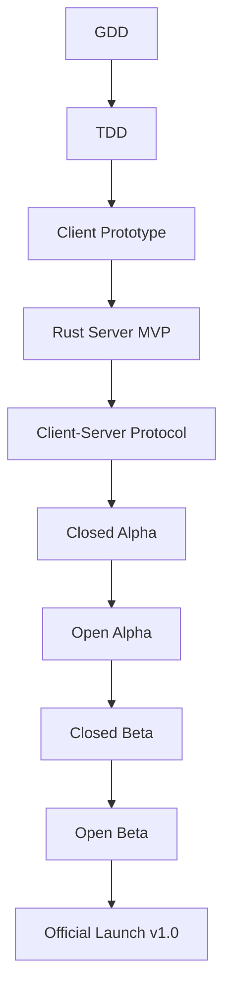

# 🗺️ **ROADMAP - The Last Signal**
> *Post-apocalyptic survival MMORPG in a persistent world*  
> **Last updated**: July 16, 2026  
> **Version**: 0.1.0 (Pre-Prototype)  

---

## 📅 **Development Phases**

---

### 🟡 **Phase 1: Documentation & Preparation (JULY 2026 - MARCH 2027)**
**Objective**: Finalize **all project documentation** and prepare the development pipeline without rushing.

| Task | Subtasks | Owner | Status | Target Date | Success Criteria |
|------|----------|-------|--------|-------------|------------------|
| **📚 Finalize GDD** | Complete the remaining 53 files (mechanics, lore, system designs). | **Cyril / Morgan** | 🟡 In progress | **2026-11-30** | 100% of GDD validated by Morgan and shared with the team. |
| **🏗 Finalize TDD** | Technical architecture, network protocols, database schemas. | **Cyril / Morgan** | ⚪ Not started | **2027-01-15** | 100% of TDD validated by Morgan and shared with the team. |
| **📖 Lore & Universe** | World history, factions, key characters, and global events. | **Cyril / Morgan** + Louanne | ⚪ Not started | **2027-02-28** | Consistent lore integrated into GDD. |
| **🎮 Gameplay Design** | Survival systems, combat, crafting, economy (detailed specs). | **Cyril** | ⚪ Not started | **2027-03-15** | All gameplay systems specified in GDD. |
| **📂 Project Setup** | Directory layout, coding standards, CI/CD pipelines. | **Cyril / Morgan** | ⚪ Not started | **2027-03-31** | Repository fully prepared for development. |

➡️ **Duration**: **9 months** → **Absolute priority on documentation and design clarity**.

---

### 🟡 **Phase 2: Minimal Prototyping (APRIL 2027 - SEPTEMBER 2027)**
**Objective**: Build a **playable prototype** featuring core survival mechanics.

| Task | Subtasks | Owner | Status | Target Date | Success Criteria |
|------|----------|-------|--------|-------------|------------------|
| **🎮 Client Prototype (Python)** | Basic 2D rendering, player movement, interaction (picking up items). | **Cyril / Morgan** | ⚪ Not started | **2027-06-30** | Player can move and interact with 3 items. |
| **🦀 Rust Server (MVP)** | Support 10 concurrent connections, position synchronization. | **Cyril / Morgan** | ⚪ Not started | **2027-08-15** | Stable server with 10 simultaneous players. |
| **🗄 Database (PostgreSQL)** | Schema for players, inventories, and persistent world state. | **Cyril / Morgan** | ⚪ Not started | **2027-07-30** | Functional local database. |
| **🎨 Minimal Assets** | 1 tilemap ("Ruins" biome), 1 player sprite, 3 item sprites. | Axel, David | ⚪ Not started | **2027-08-30** | Assets integrated and animated. |
| **🔧 Build Tooling** | Automation scripts to launch client/server locally. | **Cyril / Morgan** | ⚪ Not started | **2027-09-30** | Single command to start the full game environment. |

➡️ **Duration**: **6 months** → **Playable local MVP**.

---

### 🟡 **Phase 3: Closed Alpha (OCTOBER 2027 - DECEMBER 2027)**
**Objective**: **Internal playable release** with complete survival mechanics.

| Task | Subtasks | Owner | Status | Target Date | Success Criteria |
|------|----------|-------|--------|-------------|------------------|
| **🌐 Client-Server Protocol** | Finalized network protocol (WebSockets/TCP), action synchronization. | **Cyril / Morgan** | ⚪ Not started | **2027-10-31** | 20 players without desynchronization. |
| **⚔️ PvE Combat (Basic)** | 1 enemy archetype, basic attack patterns, damage resolution. | **Cyril / Morgan** | ⚪ Not started | **2027-11-30** | Player can defeat 3 different enemy types. |
| **🏺 Inventory & Crafting** | Gathering, storage, and crafting 5 items. | **Cyril / Morgan** | ⚪ Not started | **2027-12-15** | Player can craft a sword and a potion. |
| **🌍 Static World** | 1 biome ("Ruins") with resources and points of interest. | **Cyril / Morgan** + Axel | ⚪ Not started | **2027-12-31** | Explorable 200x200 tile world. |
| **👥 Survival System** | Hunger and health (2 core survival metrics). | **Cyril / Morgan** | ⚪ Not started | **2027-12-31** | Player must manage nutrition to survive. |

➡️ **Duration**: **3 months** → **Playable internal build**.

---

### 🟡 **Phase 4: Open Alpha (JANUARY 2028 - JUNE 2028)**
**Objective**: **Playtesting with friends and community contributors**.

| Task | Subtasks | Owner | Status | Target Date | Success Criteria |
|------|----------|-------|--------|-------------|------------------|
| **👥 Guild System (Basic)** | Guild creation and member management. | **Cyril / Morgan** | ⚪ Not started | **2028-02-29** | 3 active guilds created. |
| **💰 Minimal Economy** | Player-to-player item trading. | **Cyril / Morgan** | ⚪ Not started | **2028-03-31** | 10 tradable items. |
| **🌑 2nd Biome ("Forest")** | New enemy types and gathering resources. | Axel, David | ⚪ Not started | **2028-04-30** | Biome integrated and tested. |
| **🔒 Persistence & Auth** | Account management, progress save/load. | **Cyril / Morgan** | ⚪ Not started | **2028-05-31** | Players can reliably resume saved sessions. |
| **🐛 Fixes & Optimizations** | Major bug resolution, latency and frame rate optimizations. | **Cyril / Morgan** | ⚪ Not started | **2028-06-30** | Stable 60 FPS, 0 critical blockers. |

➡️ **Duration**: **6 months** → **Stable external test release**.

---

### 🟡 **Phase 5: Closed Beta (JULY 2028 - DECEMBER 2028)**
**Objective**: **Major feature expansion**.

| Task | Subtasks | Owner | Status | Target Date | Success Criteria |
|------|----------|-------|--------|-------------|------------------|
| **⚔️ PvP Combat** | Duels and designated combat arenas. | **Cyril / Morgan** | ⚪ Not started | **2028-08-31** | 10 bug-free PvP encounters. |
| **🌍 3rd Biome ("Desert")** | Biome boss, rare mineral deposits. | Axel, David | ⚪ Not started | **2028-09-30** | Balanced biome gameplay. |
| **🛠 Advanced Crafting** | 20 recipes, upgraded crafting stations. | **Cyril / Morgan** | ⚪ Not started | **2028-10-31** | 1 craftable item per gear category. |
| **🎭 2 Character Classes** | Survivor and Fighter (unique skill trees). | **Cyril / Morgan** | ⚪ Not started | **2028-11-30** | 2 fully functional classes. |
| **📖 Main Quests** | 3 narrative quests tied to core lore. | Louanne + **Cyril / Morgan** | ⚪ Not started | **2028-12-31** | 1 quest completed per playtester. |

➡️ **Duration**: **6 months** → **Feature-complete beta build**.

---

### 🟡 **Phase 6: Open Beta (JANUARY 2029 - JUNE 2029)**
**Objective**: **Scale testing and launch preparation**.

| Task | Subtasks | Owner | Status | Target Date | Success Criteria |
|------|----------|-------|--------|-------------|------------------|
| **🌎 4th Biome ("Mountains")** | Endgame world boss and narrative climax. | Axel, David | ⚪ Not started | **2029-02-28** | Biome fully tested. |
| **🎵 Audio & Sound Design** | Original soundtrack and immersive sound effects. | To be recruited | ⚪ Not started | **2029-03-31** | 5 music tracks + 20 sound effects. |
| **🌐 Cloud Infrastructure** | Multi-server deployment on AWS / Azure. | **Cyril / Morgan** | ⚪ Not started | **2029-04-30** | 100 concurrent players stable. |
| **🎮 Stress Testing** | Community feedback and final polish. | Team | ⚪ Not started | **2029-06-30** | 90%+ positive feedback rate. |

➡️ **Duration**: **6 months**.

---

### 🟢 **Phase 7: Official Launch (JULY 2029)**
**Objective**: **Release Version 1.0**.

| Task | Subtasks | Owner | Status | Target Date | Success Criteria |
|------|----------|-------|--------|-------------|------------------|
| **🚀 Release v1.0** | Production deployment. | Team | ⚪ Not started | **2029-07-01** | 500 players on Day 1. |
| **📦 Live Patching System** | Seamless automated updates. | **Cyril / Morgan** | ⚪ Not started | **2029-07-15** | Zero-downtime updates. |
| **🎁 Launch Events** | Community tournaments and in-game rewards. | **Cyril / Morgan** | ⚪ Not started | **2029-07-31** | 2,000 active players in Week 1. |

---

### 🟢 **Phase 8: Post-Launch (AUGUST 2029+)**
**Objective**: **Continuous content updates and live operations**.

| Task | Target Date | Notes |
|------|-------------|-------|
| New Biome (every 6 months) | Starting 2030 | Driven by player demand. |
| New Class (annual) | 2030 | Engineer archetype. |
| Hardcore Mode | 2030 | Permadeath ruleset. |
| Mobile Companion / Client | 2031+ | Optional, resource-dependent. |

---

## 📊 **Realistic Target KPIs**

| Metric | Phase 1 Target | Phase 2 Target | Final Target (v1.0) |
|:-------|:--------------:|:--------------:|:-------------------:|
| **Concurrent Players (CCU)** | — | 20 | 100+ (launch) |
| **7-Day Retention Rate** | — | 20% | 50% |
| **Critical Blocker Bugs** | 0 (doc) | Max 2 | 0 |
| **Player Satisfaction** | — | 70% | 90% |
| **Average Frame Rate** | — | 45 FPS | 60+ FPS |

---

## 🔗 **Milestone Dependencies**

