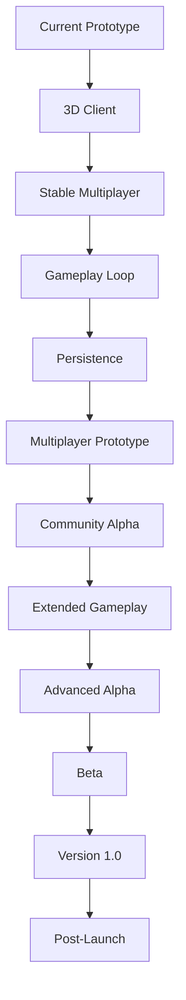

# 🗺️ **ROADMAP — The Last Signal**

> *Post-apocalyptic survival MMORPG in a persistent world*
> **Last updated:** October 8, 2026
> **Current version:** 1.0.13 — Prototype

---

## 🎯 **Project Vision**

The goal of **The Last Signal** is to turn the current technical prototype into a **playable multiplayer survival experience**, then progressively expand it through testing with contributors and players.

The priority is not to predict every feature years in advance, but to build a solid foundation, make it playable, test it, and improve it continuously.

> **Build → Test → Fix → Improve → Repeat**

---

# 📅 **Development Phases**

## 🟡 **Phase 1 — Playable Prototype**

### **October 2026 – December 2026**

**Objective:** Turn the current prototype into a coherent and playable local multiplayer experience.

| Task                    | Subtasks                                                                     | Status                     | Target  |
| ----------------------- | ---------------------------------------------------------------------------- | -------------------------- | ------- |
| **🎮 3D Client**        | Continue the transition from the 2D prototype to the VisPy-based 3D client.  | 🟡 In progress             | Q4 2026 |
| **🌍 3D Map**           | Heightmap, colors, collisions and basic environment rendering.               | 🟡 In progress             | Q4 2026 |
| **👥 Multiplayer**      | Player connection, movement synchronization and visibility of other players. | 🟡 In progress             | Q4 2026 |
| **🌐 Network Protocol** | Stabilize packets and player/session synchronization.                        | 🟡 In progress             | Q4 2026 |
| **🔐 Authentication**   | Login, authentication and temporary protection against repeated failures.    | 🟢 Implemented / improving | Q4 2026 |
| **🎒 Inventory**        | Continue stabilizing inventory and item management.                          | 🟢 Implemented / improving | Q4 2026 |
| **💰 Market**           | Stabilize the existing market and transaction systems.                       | 🟡 In progress             | Q4 2026 |
| **🧪 Tests**            | Maintain and expand Python, Rust and network tests.                          | 🟡 In progress             | Q4 2026 |
| **📚 Documentation**    | Keep technical and contributor documentation synchronized with the codebase. | 🟡 In progress             | Q4 2026 |
| **▶️ Local Launch**     | Make it easy for a contributor to launch the server and client locally.      | 🟡 In progress             | Q4 2026 |

### 🎯 Milestone

A new contributor should be able to:

1. Clone the repository.
2. Start the server.
3. Start the client.
4. Connect to the server.
5. See their character in the world.
6. Move around.
7. See other connected players.

---

## 🟡 **Phase 2 — Minimal Gameplay Loop**

### **January 2027 – March 2027**

**Objective:** Add the first complete gameplay loop on top of the playable prototype.

| Task                      | Subtasks                                                        | Status    |
| ------------------------- | --------------------------------------------------------------- | --------- |
| **🎒 Inventory Gameplay** | Make inventory interactions usable during gameplay.             | ⚪ Planned |
| **🧱 World Objects**      | Add interactable resources and objects.                         | ⚪ Planned |
| **👤 Player State**       | Health, basic survival state and persistent player information. | ⚪ Planned |
| **🍖 Survival**           | Introduce the first survival mechanics.                         | ⚪ Planned |
| **⚔️ Basic PvE**          | Introduce simple enemies and basic combat interactions.         | ⚪ Planned |
| **🧭 Exploration**        | Give players reasons to explore the environment.                | ⚪ Planned |
| **💾 Save System**        | Save and restore relevant player progress.                      | ⚪ Planned |

### 🎯 Milestone

The first complete gameplay loop should be possible:

**Explore → Find a resource → Collect it → Manage it in the inventory → Use or transform it → Continue exploring**

---

## 🟡 **Phase 3 — Multiplayer Prototype**

### **April 2027 – June 2027**

**Objective:** Make the multiplayer architecture reliable enough to support real gameplay.

| Task                               | Subtasks                                                                      | Status    |
| ---------------------------------- | ----------------------------------------------------------------------------- | --------- |
| **👥 Multiplayer Synchronization** | Synchronize relevant player states reliably.                                  | ⚪ Planned |
| **🌐 Network Reliability**         | Handle disconnects, invalid packets and network errors.                       | ⚪ Planned |
| **🌍 Persistent World**            | Move from a purely technical multiplayer prototype toward a persistent world. | ⚪ Planned |
| **🎒 Server-side Inventory**       | Ensure inventory state is correctly managed by the server.                    | ⚪ Planned |
| **⚔️ Multiplayer PvE**             | Allow multiple players to interact with the PvE environment.                  | ⚪ Planned |
| **🧪 Multiplayer Tests**           | Expand automated and integration tests for multiplayer systems.               | ⚪ Planned |

### 🎯 Milestone

The multiplayer prototype should support a stable gameplay session where several players can interact with the same world.

---

## 🟡 **Phase 4 — Community Alpha**

### **July 2027 – September 2027**

**Objective:** Put the project in the hands of external contributors and early testers.

| Task                    | Subtasks                                                             | Status    |
| ----------------------- | -------------------------------------------------------------------- | --------- |
| **🧪 External Testing** | Test the playable build with contributors and early players.         | ⚪ Planned |
| **💬 Feedback**         | Collect and organize gameplay and technical feedback.                | ⚪ Planned |
| **📊 Instrumentation**  | Add useful measurements for performance and stability.               | ⚪ Planned |
| **⚡ Optimization**      | Improve client, server and network performance.                      | ⚪ Planned |
| **📖 Onboarding**       | Make installation, contribution and testing easier for newcomers.    | ⚪ Planned |
| **🔐 Security**         | Continue reviewing authentication, networking and sensitive systems. | ⚪ Planned |

### 🎯 Milestone

External contributors should be able to **play the prototype, report problems and contribute improvements without requiring extensive assistance from the maintainers**.

---

## 🟡 **Phase 5 — Extended Gameplay**

### **October 2027 – March 2028**

**Objective:** Expand the gameplay systems once the core loop has been validated.

| Task                   | Subtasks                                               | Status    |
| ---------------------- | ------------------------------------------------------ | --------- |
| **🛠 Crafting**        | Expand gathering and crafting mechanics.               | ⚪ Planned |
| **💰 Economy**         | Expand the market and player economy.                  | ⚪ Planned |
| **⚔️ Advanced Combat** | Improve combat depth and progression.                  | ⚪ Planned |
| **🌍 World Expansion** | Add more points of interest and environmental content. | ⚪ Planned |
| **📖 Lore**            | Integrate the universe and narrative into gameplay.    | ⚪ Planned |
| **📜 Quests**          | Introduce structured objectives and quests.            | ⚪ Planned |

### 🎯 Milestone

The project should provide a broader gameplay experience instead of only a technical prototype.

---

## 🟡 **Phase 6 — Advanced Alpha**

### **April 2028 – September 2028**

**Objective:** Expand the multiplayer and progression systems.

| Task                    | Subtasks                                            | Status    |
| ----------------------- | --------------------------------------------------- | --------- |
| **👥 Groups & Guilds**  | Introduce social organization systems.              | ⚪ Planned |
| **💰 Advanced Economy** | Expand trading and economic systems.                | ⚪ Planned |
| **🌲 New Biomes**       | Introduce additional environments.                  | ⚪ Planned |
| **📈 Progression**      | Develop long-term player progression.               | ⚪ Planned |
| **📜 Advanced Quests**  | Expand narrative and gameplay objectives.           | ⚪ Planned |
| **🌐 Remote Server**    | Prepare the project for remote multiplayer testing. | ⚪ Planned |

### 🎯 Milestone

The project should be ready for larger-scale testing and a transition toward beta development.

---

## 🟠 **Phase 7 — Beta**

### **Date: To Be Defined**

**Objective:** Stabilize the complete gameplay experience before a potential 1.0 release.

The beta phase will focus primarily on:

* 🧪 Large-scale testing
* 🔐 Security
* 🌐 Network stability
* 💾 Persistence
* ⚔️ Gameplay balancing
* 🐛 Bug fixing
* ⚡ Performance
* 📚 Documentation
* 🚀 Deployment
* 📊 Player and server metrics

### 🎯 Milestone

The game must be stable enough that development can focus primarily on **polish, balancing and reliability rather than foundational systems**.

---

## 🟢 **Phase 8 — Version 1.0**

### **Date: To Be Defined**

**Objective:** Release the first stable version of **The Last Signal Online**.

The final 1.0 scope will be defined according to the results of the beta.

Potential requirements include:

* Stable multiplayer infrastructure
* Reliable persistence
* Complete core gameplay loop
* Stable combat and survival systems
* Sufficient world content
* Contributor and player documentation
* Reliable deployment process
* No known critical blockers

> **The 1.0 release date will be determined by project readiness, not by an arbitrary calendar deadline.**

---

## 🟢 **Phase 9 — Post-Launch**

### **After 1.0**

**Objective:** Continue improving the game according to player and community feedback.

Potential future additions include:

* 🌍 New biomes
* ⚔️ New combat systems
* 🎭 New specializations or classes
* 📖 Additional stories and quests
* 👥 Social features
* 🎉 Community events
* 📱 Optional mobile companion/client
* 🛠 Community-driven improvements

The post-launch roadmap will remain flexible and will depend on the project's community, technical capacity and player feedback.

---

# 📊 **Development Metrics**

Rather than fixing arbitrary long-term player numbers now, metrics will evolve with the project.

| Metric                       | Prototype            | Alpha                        | Beta / 1.0                        |
| ---------------------------- | -------------------- | ---------------------------- | --------------------------------- |
| **Concurrent Players (CCU)** | 2+                   | 10+                          | TBD                               |
| **Automated Tests**          | Increasing           | Increasing                   | High coverage of critical systems |
| **Critical Bugs**            | Minimize             | 0 blockers for test sessions | 0 known critical blockers         |
| **Performance**              | Playable             | Stable                       | Production-ready                  |
| **External Testers**         | Initial contributors | Growing community            | Larger testing pool               |
| **Retention**                | Not yet meaningful   | Measured                     | Used for balancing and evaluation |

These metrics are intended to **measure progress**, not to force development toward arbitrary numbers.

---

# 🔗 **Milestone Dependencies**

```mermaid
graph TD
    A[Current Prototype] --> B[3D Client]
    B --> C[Stable Multiplayer]
    C --> D[Gameplay Loop]
    D --> E[Persistence]
    E --> F[Multiplayer Prototype]
    F --> G[Community Alpha]
    G --> H[Extended Gameplay]
    H --> I[Advanced Alpha]
    I --> J[Beta]
    J --> K[Version 1.0]
    K --> L[Post-Launch]
```

---

# 🎯 **Current Priority**

The immediate priority is **not adding a large number of new features**.

The priority is to make the existing project **playable, understandable and testable**.

### Current focus:

1. 🎮 Finish stabilizing the 3D client.
2. 👥 Stabilize multiplayer synchronization.
3. 🌍 Provide an explorable environment.
4. 🎒 Establish the first real gameplay loop.
5. 🧪 Make it easy for contributors to test the project.
6. 🐛 Fix blockers and regressions.
7. 🔁 Repeat the cycle with feedback.

> **Build → Test → Fix → Improve → Repeat**

The roadmap will be updated as the project reaches each milestone.
